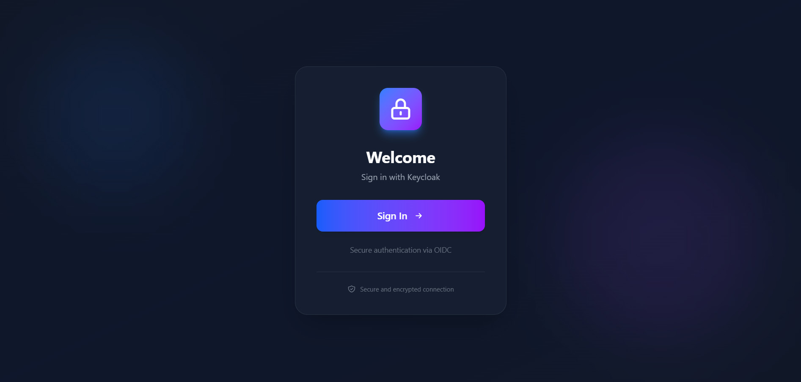

# Angular Authentication with Keycloak Template

**English** | **[Español](README.es.md)**

Authentication template for Angular applications using Keycloak as an OIDC (OpenID Connect) identity provider. This project is ready to use and can serve as a foundation for implementing secure authentication in your Angular applications.

## Features

- Complete OIDC authentication with Keycloak
- Automatic token renewal (silent renew)
- Guards for route protection
- HTTP interceptor to automatically add tokens
- Logout with token revocation
- Environment configuration (development, production)
- Docker Compose for Keycloak and PostgreSQL
- TailwindCSS for styling
- ESLint + Prettier for code quality
- Vitest for testing

## Interface Preview

### Login Page


### Dashboard


## Prerequisites

- Node.js 18+ and pnpm
- Docker and Docker Compose
- Angular CLI 21+

## Installation

### 1. Clone and install dependencies

```bash
git clone <repository-url>
cd angular-auth-keycloack
pnpm install
```

### 2. Start Keycloak with Docker

```bash
docker-compose up -d
```

This will start:
- Keycloak at `http://localhost:8080`
- PostgreSQL at `localhost:5432`

Keycloak admin credentials:
- Username: `admin`
- Password: `admin`

### 3. Configure Keycloak

#### a) Access the administration console

1. Go to `http://localhost:8080`
2. Click on "Administration Console"
3. Login with admin/admin

#### b) Create the Realm

1. In the top-left menu, click "Create realm"
2. Name: `angular-auth-realm`
3. Click "Create"

#### c) Create the Client

1. Go to "Clients" in the sidebar
2. Click "Create client"
3. Configure:
   - **Client type**: OpenID Connect
   - **Client ID**: `angular-client`
4. Click "Next"
5. Configure:
   - **Client authentication**: OFF
   - **Authorization**: OFF
   - **Authentication flow**: Check "Standard flow" and "Direct access grants"
6. Click "Next"
7. Configure URLs:
   - **Root URL**: `http://localhost:4200`
   - **Home URL**: `http://localhost:4200`
   - **Valid redirect URIs**: `http://localhost:4200/*`
   - **Valid post logout redirect URIs**: `http://localhost:4200/*`
   - **Web origins**: `http://localhost:4200`
8. Click "Save"

#### d) Configure Client Scopes (Advanced)

1. In the `angular-client` client, go to the "Client scopes" tab
2. Ensure these are assigned:
   - `openid`
   - `profile`
   - `email`
   - `offline_access` (for refresh tokens)

#### e) Create a test user

1. Go to "Users" in the sidebar
2. Click "Create new user"
3. Configure:
   - **Username**: `testuser`
   - **Email**: `test@example.com`
   - **Email verified**: ON
   - **First name**: Test
   - **Last name**: User
4. Click "Create"
5. Go to the "Credentials" tab
6. Click "Set password"
7. Set password: `test123`
8. Uncheck "Temporary"
9. Click "Save"

### 4. Start the Angular application

```bash
pnpm start
```

The application will be available at `http://localhost:4200`

## Project Structure

```
angular-auth-keycloack/
├── src/
│   ├── app/
│   │   ├── auth/                      # Authentication module
│   │   │   ├── auth.config.ts         # OIDC configuration
│   │   │   ├── auth.guard.ts          # Guard for protected routes
│   │   │   ├── auth.interceptor.ts    # Interceptor to add tokens
│   │   │   └── auth.service.ts        # Authentication service
│   │   ├── components/
│   │   │   ├── callback/              # OIDC callback component
│   │   │   ├── dashboard/             # Protected page (example)
│   │   │   └── login/                 # Login page
│   │   ├── app.config.ts              # Main app configuration
│   │   ├── app.routes.ts              # Route definitions
│   │   ├── app.ts                     # Root component
│   │   └── app.html                   # Root template
│   ├── environments/                  # Environment variables
│   │   ├── environment.ts             # Default env
│   │   ├── environment.development.ts # Development env
│   │   └── environment.production.ts  # Production env
│   ├── main.ts                        # Entry point
│   └── index.html                     # Main HTML
├── keycloak/                          # Configuration screenshots
├── docker-compose.yml                 # Docker configuration
├── package.json                       # Dependencies and scripts
├── angular.json                       # Angular configuration
├── tsconfig.json                      # TypeScript configuration
└── tailwind.config.js                 # TailwindCSS configuration
```

## Environment Configuration

### Development (`src/environments/environment.development.ts`)

```typescript
export const environment = {
  production: false,
  keycloak: {
    clientId: 'angular-client',
    authority: 'http://localhost:8080/realms/angular-auth-realm',
    redirectUrl: 'http://localhost:4200/callback',
    postLogoutRedirectUri: 'http://localhost:4200',
  },
  apiUrl: 'http://localhost:3000/api',
};
```

### Production (`src/environments/environment.production.ts`)

Update with production URLs:

```typescript
export const environment = {
  production: true,
  keycloak: {
    clientId: 'angular-client',
    authority: 'https://your-keycloak.com/realms/angular-auth-realm',
    redirectUrl: 'https://your-app.com/callback',
    postLogoutRedirectUri: 'https://your-app.com',
  },
  apiUrl: 'https://your-api.com/api',
};
```

## Available Scripts

```bash
# Development
pnpm start              # Start development server at http://localhost:4200

# Build
pnpm build              # Production build
pnpm watch              # Build in watch mode

# Testing
pnpm test               # Run tests with Vitest

# Linting and formatting
pnpm lint               # Run ESLint
pnpm format             # Format code with Prettier
```

## Authentication Flow

1. **Unauthenticated user** accesses the application
2. Redirected to `/login`
3. When clicking "Login", the OIDC flow starts:
   - Redirect to Keycloak
   - User enters credentials
   - Keycloak validates and redirects to `/callback` with authorization code
4. **CallbackComponent** processes the code and obtains tokens
5. User is redirected to the dashboard
6. **AuthGuard** protects routes that require authentication
7. **AuthInterceptor** automatically adds the token to HTTP requests
8. Tokens are automatically renewed before expiring (silent renew)

## Authentication Architecture

The project uses a **layered architecture** for authentication:

```
Components (Login, Dashboard, etc.)
         ↓
   AuthService (Abstraction)
         ↓
OidcSecurityService (angular-auth-oidc-client)
         ↓
     Keycloak
```

**Why use `AuthService` instead of `OidcSecurityService` directly?**

- **Abstraction**: If you change OIDC library, only modify `AuthService`
- **Consistency**: All components use the same interface
- **Maintainability**: Centralized logic in one place
- **Testing**: Easier to mock `AuthService`

## Using AuthService

The project already uses `AuthService` consistently across all components. Examples:

### Login Component (src/app/components/login/login.component.ts:28)

```typescript
import { AuthService } from '../../auth/auth.service';

export class LoginComponent {
  private authService = inject(AuthService);

  login() {
    this.authService.login(); // Start OIDC flow
  }
}
```

### Dashboard Component (src/app/components/dashboard/dashboard.component.ts:30)

```typescript
import { AuthService } from '../../auth/auth.service';

export class DashboardComponent {
  private authService = inject(AuthService);

  userData$ = this.authService.getUserData$();
  accessToken$ = this.authService.getAccessToken$();

  logout() {
    this.authService.logout(); // Logout and revoke tokens
  }
}
```

### Callback Component (src/app/components/callback/callback.component.ts:28)

```typescript
import { AuthService } from '../../auth/auth.service';

export class CallbackComponent {
  private authService = inject(AuthService);

  ngOnInit() {
    this.authService.checkAuth().subscribe(result => {
      if (result.isAuthenticated) {
        // Redirect to dashboard
      }
    });
  }
}
```

### Available methods in AuthService

```typescript
// Start login
authService.login(): void

// Logout and revoke tokens
authService.logout(): void

// Check authentication
authService.checkAuth(): Observable<LoginResponse>
authService.isAuthenticated(): Observable<boolean>

// Get user data
authService.getUserData$(): Observable<UserDataResult>

// Get tokens
authService.getAccessToken$(): Observable<string>
authService.getIdToken$(): Observable<string>
```

## Route Protection

The project includes an example of a protected route in `src/app/app.routes.ts:11`:

```typescript
import { authGuard } from './auth/auth.guard';

const routes: Routes = [
  { path: 'login', component: LoginComponent },
  { path: 'callback', component: CallbackComponent },
  {
    path: 'dashboard',              // Protected route in the project
    component: DashboardComponent,
    canActivate: [authGuard],       // Guard that verifies authentication
  },
];
```

The `authGuard` verifies that the user is authenticated. If not, it automatically redirects to `/login`.

**To add more protected routes**, simply add `canActivate: [authGuard]`:

```typescript
{
  path: 'admin',
  component: AdminComponent,
  canActivate: [authGuard],  // New protected route
}
```

## HTTP Interceptor and Tokens

### What token is sent to the API?

The `AuthInterceptor` (configured in `src/app/auth/auth.interceptor.ts:6`) automatically adds the **Keycloak JWT Access Token** to all HTTP requests:

```typescript
export const authInterceptor: HttpInterceptorFn = (req, next) => {
  const oidcSecurityService = inject(OidcSecurityService);

  return oidcSecurityService.getAccessToken().pipe(
    switchMap((token) => {
      if (token) {
        req = req.clone({
          setHeaders: {
            Authorization: `Bearer ${token}`,  // Keycloak JWT Token
          },
        });
      }
      return next(req);
    }),
  );
};
```

### JWT Token Content

The token sent contains user and authentication information:

```json
{
  "exp": 1738675200,
  "iat": 1738671600,
  "iss": "http://localhost:8080/realms/angular-auth-realm",
  "sub": "user-uuid",
  "preferred_username": "testuser",
  "email": "test@example.com",
  "given_name": "Test",
  "family_name": "User",
  "scope": "openid profile email"
}
```

### Validation in your Backend API

Your backend API must **validate this JWT token** against Keycloak. Examples:

#### Node.js/Express

```bash
npm install express-jwt jwks-rsa
```

```javascript
const jwt = require('express-jwt');
const jwksRsa = require('jwks-rsa');

// Automatic token validation
app.use(jwt({
  secret: jwksRsa.expressJwtSecret({
    jwksUri: 'http://localhost:8080/realms/angular-auth-realm/protocol/openid-connect/certs'
  }),
  audience: 'angular-client',
  issuer: 'http://localhost:8080/realms/angular-auth-realm',
  algorithms: ['RS256']
}));

// Protected route
app.get('/api/protected', (req, res) => {
  // req.user contains token data
  res.json({ message: 'Authenticated', user: req.user });
});
```

### Current interceptor configuration

The interceptor is configured in `src/app/app.config.ts`:

```typescript
provideHttpClient(
  withInterceptors([authInterceptor])
)
```

**IMPORTANT**: The interceptor adds the token to **all HTTP requests**. If you make requests to external APIs that shouldn't have the token, modify the interceptor:

```typescript
export const authInterceptor: HttpInterceptorFn = (req, next) => {
  const oidcSecurityService = inject(OidcSecurityService);

  // Only add token to your API requests
  const isApiRequest = req.url.startsWith(environment.apiUrl);

  if (!isApiRequest) {
    return next(req); // Don't add token to external URLs
  }

  return oidcSecurityService.getAccessToken().pipe(
    switchMap((token) => {
      if (token) {
        req = req.clone({
          setHeaders: {
            Authorization: `Bearer ${token}`,
          },
        });
      }
      return next(req);
    }),
  );
};
```

## Customization

### Change realm name

1. Update in Keycloak
2. Update in `src/environments/environment.development.ts`:
   ```typescript
   authority: 'http://localhost:8080/realms/YOUR-REALM'
   ```

### Change client name

1. Update in Keycloak
2. Update in `src/environments/environment.development.ts`:
   ```typescript
   clientId: 'your-client-id'
   ```

### Add more scopes

In `src/app/auth/auth.config.ts`:
```typescript
scope: 'openid profile email offline_access roles'
```

## Troubleshooting

### Error: "Invalid redirect_uri"

Verify that the callback URL is correctly configured in:
- Keycloak: Valid redirect URIs
- `environment.ts`: redirectUrl

### Error: "Client not found"

Verify that the `clientId` in `environment.ts` exactly matches the Client ID in Keycloak.

### Tokens don't renew

Verify that:
- The `offline_access` scope is included
- `useRefreshToken: true` is in `auth.config.ts`
- The client has "Standard flow" enabled

### Doesn't redirect after login

Verify that:
- The `/callback` route is configured
- The CallbackComponent is imported

## Technology Stack

- **Angular 21.1.2**: Main framework
- **angular-auth-oidc-client 21.0.1**: OIDC library
- **Keycloak 26.5.2**: Identity provider
- **TailwindCSS 4.1.18**: Styling framework
- **Vitest 4.0.18**: Testing
- **ESLint + Prettier**: Code quality
- **Docker + Docker Compose**: Containerization

## Next Steps

- [ ] Configure roles and permissions in Keycloak
- [ ] Implement role-based authorization
- [ ] Add refresh token rotation
- [ ] Configure 2FA/MFA
- [ ] Implement protected backend API
- [ ] Configure HTTPS for production
- [ ] Add e2e tests

## Useful Resources

- [Keycloak Documentation](https://www.keycloak.org/documentation)
- [angular-auth-oidc-client](https://github.com/damienbod/angular-auth-oidc-client)
- [OIDC Specification](https://openid.net/connect/)
- [Configuration screenshots](./keycloak/)

## License

MIT

## Contributions

Contributions are welcome. Please open an issue or pull request.
